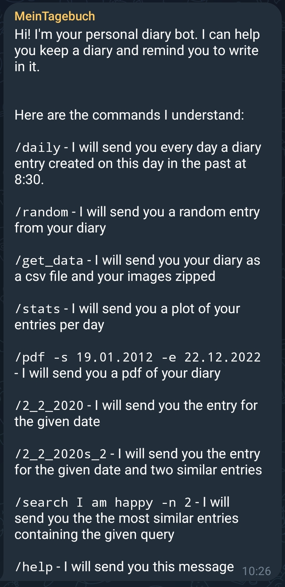

# Diary Telegram Bot
With this repository you can start a telegram bot, which can be used to keep notes or diary entries.

## Install
1. Create a bot with [botfather](https://core.telegram.org/bots/tutorial)
2. Add your bot token to the `config.json` file
3. Create an openai api key and add it to the `config.json` file
4. Create a chat group with your bot and add the chat id to the `config.json` file
5. Give all rights to the bot in telegram
6. Checkout the repository and start with docker-compose

## Usage
### Commands
- `/help` - Show all commands
